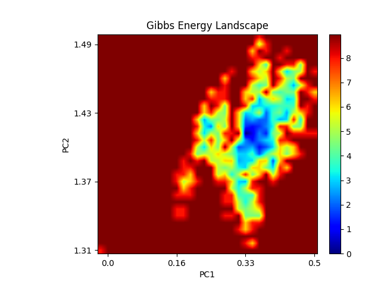

---
output:
  pdf_document: default
  html_document: default
---

# Gromacs guide for iGEMers


This is a record of XJTLU-CHINA 2022 Dry Lab implementation which also serves as a guide for subsequent iGEMers in Molecular Dynamics (Gromacs, etc)

For more information, please refer to [Gromacs.org](https://www.gromacs.org/)

Contact: Jiayi.Li21@student.xjtlu.edu.cn

## Installation


1.[cmake](https://cmake.org/install/) (C compiler)

GROMACS builds with the CMake build system, requiring at least version 3.16.3. You can check whether CMake is installed, and what version it is, with cmake --version. If you need to install CMake, then first check whether your platform’s package management system provides a suitable version, or visit the CMake installation page for pre-compiled binaries, source code and installation instructions. The GROMACS team recommends you install the most recent version of CMake you can.

```shell
$cd cmake-3.24.1
$./configure --prefix=/export/home/jiayi.li/gromacs_compile/cmake
$make
$make install
```

2.[FFTW](http://www.fftw.org/download.html) (Fast Fourier Transform library)

Many simulations in GROMACS make extensive use of fast Fourier transforms, and a software library to perform these is always required.Generally, there is no advantage in using MKL with GROMACS, and FFTW is often faster. With PME GPU offload support using CUDA, a GPU-based FFT library is required. The CUDA-based GPU FFT library cuFFT is part of the CUDA toolkit (required for all CUDA builds) and therefore no additional software component is needed when building with CUDA GPU acceleration.

```shell
$cd fftw-3.3.10

$./configure --enable-mpi --enable-shared --enable-float -- prefix=/export/home/jiayi.li/gromacs_compile/fftw

$make
$make install
```

3.[Openmpi](https://www.open-mpi.org/)(OpenMPI library parallel computing )

For maximum performance you will need to examine how you will use GROMACS and what hardware you plan to run on. Often OpenMP parallelism is an advantage for GROMACS, but support for this is generally built into your compiler and detected automatically.

```shell
    cd openmpi-4.1.1

    $ wget https://download.open-mpi.org/release/open-mpi/v4.1/openmpi-4.1.1.tar.gz
    $ tar -xzvf openmpi-4.1.1.tar.gz
    $ cd openmpi-4.1.1/
    $ mkdir my-install/
    $ ./configure --prefix=/home/jiayi.li/compiler/openmpi-4.1.1/my-install CC=gcc CXX=g++ FC=gfortran
    $ make -j4
    $ make install

    #./configure CC=icc CXX=icpc F77=ifort FC=ifort F90=ifort
    #--prefix=/export/home/jiayi.li/gromacs_compile/openmpi


    $ export PATH=/home/jiayi.li/compiler/openmpi-4.1.1/my-install/bin:${PATH}
    $ export LD_LIBRARY_PATH=/home/jiayi.li/compiler/openmpi-4.1.1/my-install/lib:${LD_LIBRARY_PATH}
    $ which mpicc
    ~/compiler/openmpi-4.1.1/my-install/bin/mpicc
```

4.[Gromacs](http://www.gromacs)

GROMACS can be compiled for many operating systems and architectures. These include any distribution of Linux, Mac OS X or Windows, and architectures including x86, AMD64/x86-64, several PowerPC including POWER8, ARM v8, and SPARC VIII.

On Linux, the clang compilers typically use for their C++ library the libstdc++ which comes with g++. For GROMACS, we require the compiler to support libstc++ version 7.1 or higher. To select a particular libstdc++ library, provide the path to g++ with -DGMX_GPLUSPLUS_PATH=/path/to/g++.

To build with clang and llvm’s libcxx standard library, use -DCMAKE_CXX_FLAGS=-stdlib=libc++.

If you are running on Mac OS X, the best option is gcc. The Apple clang compiler provided by MacPorts will work, but does not support OpenMP, so will probably not provide best performance.

Environmental Variable settings(crucial):

``` shell
vim ~ /source
source ~/ .bashrc
vim ~/.bashrc

# Source global definitions 
if [ -f /etc/bashrc ]; then
        /etc/bashrc
fi

# User specific aliases 
source /export/home/jiayi.li/source


export FFTW_LOCATION=/home/jiayi.li/fftw-3.3.10
export MPICCDIR=/home/jiayi.li/openmpi-4.1.1
export CXX=mpic++
export CC=mpicc
```


```shell

$ wget ftp://ftp.gromacs.org/gromacs/gromacs-2021.2.tar.gz
$ tar -xzvf gromacs-2021.2.tar.gz
$ cd gromacs-2021.2/
$ mkdir my-compile/ my-install/
$ cd my-compile
$ cmake .. -DCMAKE_INSTALL_PREFIX=/home/jiayi.li/software/gromacs-2021.2/my-install -DCMAKE_C_COMPILER=mpicc -DCMAKE_CXX_COMPILER=mpicxx -DGMX_MPI=on -DGMX_FFT_LIBRARY=fftw3 -DCMAKE_PREFIX_PATH=/home/jiayi.li/lib/fftw-3.3.9/my-install
$ make
$ make install


$ export PATH=/home/jiayi.li/software/gromacs-2021.2/my-install/bin:${PATH}
$ export LD_LIBRARY_PATH=/home/jiayi.li/software/gromacs-2021.2/my-install/lib64:${LD_LIBRARY_PATH}
```


## Input files

1.Primary structure file *.gro ,* .pdb

2.Parameter control file \*mdp

3.Force field file *.top,* .itp

4.Search index file \*.ndx

Gromacs Workflow


## Supplementary tools

1.Modelling: Gauss View , Material studio, *Packmol*, *VMD*

2.Force field: AMBER, CHARMM, OPLS-AA, GROMACS, [MARTINI](http://md.chem.rug.nl/)(for complex biological system like membrance)

3.Gromacs force field : pdb2gmx, AMBER Tool, tppmktop, x2top, martini.py, ATB/PRODRG...

4.Post processing : gmx msd, gmx totcf, gmx potential, gmx helix, MD_Analysis, VMD, or Python, C++ , Fortan to customize

## Simulation Tutorial

1.splitting up the system :To just get the protein itself we can use the following grep command to remove lines containing the water symbol 'HOH'.

2.Creating a Gromacs topology (PDB2GMX)

```shell

    grep -v 'HOH' shMT.pdb > shMT_protein.pdb
    gmx pdb2gmx -f shMT_protein.pdb
    gmx pdb2gmx -f shMT_protein.pdb

```

Define box and solvate

```shell
$gmx solvate -cp shMT-box.gro -cs spc216.gro -o shMT-solv.gro -p topol.top

```


4.Adding ions to your solvated system can serve two purposes: it can help to neutralise any charge in your system; and it allows you to simulate systems with similar salt concentrations to their real-world equivalents.

You may have noticed earlier that our system is charged. Here we will neutralise it by adding ions.

Adding ions is done in two parts: first, you need to use the grompp tool to generate a .tpr file to be used when adding ions, and then you must replace some of the recently-added solvent molecules with the necessary counterions using genion.

The GROMACS preprocessor tool grompp reads in coordinate and topology files to generate an atomic-level input file (with a .tpr extension). This .tpr file contains all of the parameters needed for all atoms in the system.

In order to generate a run input .tpr file, grompp needs a structure (.gro) file, a topology (.top) file, and a file defining the instructions for the simulation run (this is kept in an .mdp file). This .mdp file can be kept empty when ionising the system as no actual simulation is to be run. To generate the .tpr file, run:

```shell
    touch mdrun.mdp
    gmx grompp -f mdrun.mdp -c shMT-solv.gro -p topol.top -o ions.tpr 

    gmx genion -s ions.tpr -p topol.top -neutral -o  shMT-neutral.gro
```

5.Energy minimization

.mdp file minimization

```shell

    ; minim.mdp - taken from http://www.mdtutorials.com/gmx/
    ; Parameters describing what to do, when to stop and what to save
      integrator      = steep     ; steepest descent algorithm
      emtol           = 1000.0    ; Stop minimization when max. force < 1000.0 kJ/mol/nm
      emstep          = 0.01      ; Minimization step size
      nsteps          = 50000     ; Maximum number of (minimization) steps to perform

      ; Logs and outputs
      nstlog          = 500       ; number of steps between each log output
      nstenergy       = 500       ; number of steps between each energy file output
      nstxout         = 500       ; number of steps between each output to the coordinate file
      
      ; Parameters describing how to find the neighbors of each atom and how to calculate the interactions
      nstlist         = 1         ; Frequency to update the neighbor list and long range forces
      cutoff-scheme   = Verlet    ; Buffered neighbor searching
      ns_type         = grid      ; Method to determine neighbor list (simple, grid)
      coulombtype     = PME       ; Treatment of long range electrostatic interactions
      rcoulomb        = 1.0       ; Short-range electrostatic cut-off
      rvdw            = 1.0       ; Short-range Van der Waals cut-off
      pbc             = xyz       ; Periodic Boundary Conditions in all 3 dimensions

    gmx grompp -f minim.mdp -c shMT-neutral.gro -p topol.top -o ener_minim.tpr

    gmx energy -f ener.edr -o potential.xvg

    gmx mdrun -v -deffnm em_minim.tpr

    gmx energy -f em.edr -o potential.xvg

```

6.Equilibration: simulations

EM ensured that we have a reasonable starting structure, in terms of geometry and solvent orientation. To begin real dynamics, we must equilibrate the solvent and ions around the protein. If we were to attempt unrestrained dynamics at this point, the system may collapse. The reason is that the solvent is mostly optimized within itself, and not necessarily with the solute. It needs to be brought to the temperature we wish to simulate and establish the proper orientation about the solute (the protein). After we arrive at the correct temperature (based on kinetic energies), we will apply pressure to the system until it reaches the proper density.

Remember that posre.itp file that pdb2gmx generated a long time ago? We're going to use it now. The purpose of posre.itp is to apply a position restraining force on the heavy atoms of the protein (anything that is not a hydrogen). Movement is permitted, but only after overcoming a substantial energy penalty. The utility of position restraints is that they allow us to equilibrate our solvent around our protein, without the added variable of structural changes in the protein. The origin of the position restraints (the coordinates at which the restraint potential is zero) is provided via a coordinate file passed to the -r option of grompp.

Equilibration is often conducted in two phases. The first phase is conducted under an NVT ensemble (constant Number of particles, Volume, and Temperature). This ensemble is also referred to as "isothermal-isochoric" or "canonical." The timeframe for such a procedure is dependent upon the contents of the system, but in NVT, the temperature of the system should reach a plateau at the desired value. If the temperature has not yet stabilized, additional time will be required. Typically, 50-100 ps should suffice, and we will conduct a 100-ps NVT equilibration for this exercise. Depending on your machine, this may take a while (just under an hour if run in parallel on 16 cores or so).

NPT
```shell

    gmx grompp -f npt.mdp -c confout.gro -r confout.gro -p topol.top -o npt.tpr
```
NVT
```shell
    gmx grompp -f nvt.mdp -c em.gro -r em.gro -p topol.top -o nvt.tpr

    gmx mdrun -deffnm nvt
```

The previous step, NVT equilibration, stabilized the temperature of the system. Prior to data collection, we must also stabilize the pressure (and thus also the density) of the system. Equilibration of pressure is conducted under an NPT ensemble, wherein the Number of particles, Pressure, and Temperature are all constant. The ensemble is also called the "isothermal-isobaric" ensemble, and most closely resembles experimental conditions.

The .mdp file used for a 100-ps NPT equilibration can be found here. It is not drastically different from the parameter file used for NVT equilibration. Note the addition of the pressure coupling section, using the Parrinello-Rahman barostat.

A few other changes:

continuation = yes: We are continuing the simulation from the NVT equilibration phase
gen_vel = no: Velocities are read from the trajectory (see below)
We will call grompp and mdrun just as we did for NVT equilibration. Note that we are now including the -t flag to include the checkpoint file from the NVT equilibration; this file contains all the necessary state variables to continue our simulation. To conserve the velocities produced during NVT, we must include this file. The coordinate file (-c) is the final output of the NVT simulation.


command of npt.mdp file
```
     ; npt.mdp -- taken from: https://docs.bioexcel.eu/gromacs_bpg/
      ; Intergrator, timestep, and total run time
      integrator               = md                ; Leap-frog MD algorithm
      dt                       = 0.002             ; Sets timestep at 2 ns
      nsteps                   = 500000            ; Sim will run 500,000 timesteps
      
      ; Logs and outputs
      nstlog                   = 500               ; Output to md.log every 500 dt
      nstenergy                = 500               ; Output to ener.edr every 500 dt
      nstxout                  = 500               ; Output to trajj.trr every 500 dt
      
      ; Bond constraints
      constraints              = h-bonds           ; Make H bonds in protein be rigid
      constraint-algorithm     = lincs             ; Define algorithm to make bonds rigid
      
      ; Van der Waals interactions
      vdwtype                  = Cut-off           ; Define type of short-ranged interaction
      rvdw                     = 1.0               ; Define short-ranged cutoff as 1 nm
      cutoff-scheme            = Verlet            ; Generate pair lists to speed up simulation
      DispCorr                 = EnerPres          ; Apply corrections to mitigate using cutoff
      pbc                      = xyz               ; PBC in all 3 dimensions
      
      ; Coulombic interactions
      coulombtype              = PME               ; Define type of long-ranged interactions
      rcoulomb                 = 1.0               ; Define long-ranged cutoff as 1nm
      
      ; Thermostat
      tcoupl                   = V-rescale         ; Define type of thermostat
      tc-grps                  = Protein  SOL NA   ; Define groups to be affected by thermostat
      ref-t                    = 300      300 300  ; Define temperature for each group in Kelvins
      tau-t                    = 0.1      0.1 0.1  ; Define temperature coupling time
      
      ; Barostat
      pcoupl                   = Parrinello-Rahman ; Define type of barostat
      ref-p                    = 1.0               ; Define system pressure in bars
      tau-p                    = 2.0               ; Define pressure coupling time
      compressibility          = 4.5e-5            ; Define compressibility of system in bar^-1
```

Analyze the temperature progression, again using energy:

```shell
$gmx energy -f nvt.edr -o temperature.xvg
```


We have now used GROMACS to run a molecular dynamics simulation and analyzed some of the results. This tutorial is not meant to be exhaustive. GROMACS can be used to perform a wide range of simulations (free energy calculations, non-equilibrium MD, and normal modes analysis, just to name a few). Future iGEMers should also consult the literature and the GROMACS manual for suggestions on how to improve the efficiency and accuracy of the abovementioned .mdp files .

## Analysis

Upon completion of the two equilibration phases, the system is now well-equilibrated at the desired temperature and pressure. We are now ready to release the position restraints and run production MD for data collection. 

Take our case as an example:

1.  Free Energy Landscape analysed in Gromacs:

gmx

```shell
# 1. Correction of periodicity
# 2. Deletion of -fit rot+trans
gmx trjconv -s pro.tpr -f npt1.xtc -o npt1.xtc -fit rot+trans
```       

RMSD and Gyrate
```shell
gmx rms -s pro.tpr -f npt1.xtc -o rmsd.xvg
# Choice for backbone
gmx gyrate -s pro.tpr -f npt1.xtc -o gyrate.xvg
```

The resulting rmsd.xvg and gyrate.xvg also need to be processed to remove all comment lines (lines starting with \# or \@ and blank lines), and the gyrate file also contains gyrate-radius data in all three directions, as well (this can be done with an editor that includes block editing). The rmsd.xvg and gyrate.xvg files have only two columns of data.The first column is the time, and the second column is the RMSD or gyrate data. Then we need to combine the two files. The RMSD and gyrate data at the same time are written on the same line, so the combined file contains three columns: time, RMSD, and Gyrate data. This step can be done through an editor that supports block editing, or it can be performed with a script.

```shell

    pc_combine.py rmsd.xvg gyrate.xvg output.xvg
```

Here, pc_combine.py is a script to combine such data, reading in the files pointed to by the first two arguments and outputting the result to the file pointed to by the third argument.

Once we have the combined file, we can use the sham command of Gromacs to generate the free energy topography. Sham is a complex command that can take many inputs and outputs, so I recommend reading the help information in GMX help Sham.

For this example, we will use the following command to generate the free energy topography:

```shell
gmx sham -tsham 310 -nlevels 100 -f output.xvg -ls gibbs.xpm -g gibbs.log -lsh enthalpy.xpm -lss entropy.xpm
xpm2png.py -ip yes -f gibbs.xpm
```

Illustration of parameters

-tsham ：set temperature

-nlevels： set FEL levels

-f : read combined files

-ls : Output free energy topography (Gibbs free energy)

-g ：output log file

-lsh : enthalpy topology

-lss : entropy topology

3.Using PCA for the plot of FEL

To obtain the principal components, we need to perform principal component analysis on the trajectory. GMX provides the Covar command and anaeig command to help us with the correlation analysis. Care must be taken to eliminate the translation and rotation of the trajectory before PCA, so that the overall motion of the molecule does not interfere with the analysis of the internal motion of the molecule.

The role of the covar command is to perform the calculation of the covariance matrix and the eigenvector on the trajectory.

eigenvalues.xvg : Order and size of eigenvalues eigenvectors.trr is the trajectory projected onto the eigenvector covapic.xpm is the covariance matrix of the trajectory

```shell
$gmx covar -s pro.tpr -f npt1.xtc -o eigenvalues.xvg -v eigenvectors.trr -xpma covapic.xpm 
```

This command will tell you which atoms to use for align, c-alpha or backbone, and then it will tell you which atoms to use for PCA, either c-alpha or backbone, depending on your needs. Of course, you could have chosen other index groups for align and PCA, but the reason for this is that they have a slightly lower number of atoms, so the analysis is faster, and the result is usually not noticeable in terms of FEL.

Eigenvalues.xvg stores multiple eigenvalues sorted by their magnitude. For FEL, it is generally desirable that the sum of the magnitude of the first two eigenvalues can be as large as possible, which means that the first two principal components can represent most of the motion information of the protein.

Covapic.xpm stores the covariance matrix, which is also an XPM file and can be viewed with xpm2png.py. (This section is also covered in the next subsection, so it is omitted here.)

The anaeig command will then be used to project the trace onto the first two principal components, which will generate pc1.xvg and pc2.xvg, which will be used in the same way as rmsd.xvg and gyrate.xvg.


```shell

$gmx anaeig -s pro.tpr -f npt1.xtc -v eigenvectors.trr -first 1 -last 1 -proj pc1.xvg  
$gmx anaeig -s pro.tpr -f npt1.xtc -v eigenvectors.trr -first 2 -last 2 -proj pc2.xvg 

$pc_combine.py pc1.xvg pc2.xvg pc12_sham.xvg
$gmx sham -tsham 310 -nlevels 100 -f pc12_sham.xvg -ls pc12_gibbs.xpm -g pc_12.log -lsh $pc12_enthalpy.xpm -lss pc12_entropy.xpm
```

2.Using Bio3D R package for visualization

```R

library("bio3d")
# load trace and pdb file
dcd <- read.dcd("pro.dcd")
pdb <- read.pdb("pro.pdb")
# C-alpha atom choice analysis
ca.inds <- atom.select(pdb, elety="CA")
xyz <- fit.xyz(fixed=pdb$xyz, mobile=dcd, fixed.inds=ca.inds$xyz,mobile.inds=ca.inds$xyz)
dim(xyz) == dim(dcd)
# Plot covariance matrix
cij <- dccm(xyz[,ca.inds$xyz])
plot(cij)
# plot PCA 
pc <- pca.xyz(xyz[,ca.inds$xyz])
plot(pc, col=bwr.colors(nrow(xyz)))
```


In this figure, the blue part shows the synergy and the red part shows the relative motion. Both axes are amino acid sequence labels. Such a covariance matrix plot is very useful for analyzing the trend of mutual motion between amino acids. For example, the opening and closing of enzyme substrate pockets are analyzed. Because the protein used in the example is a Metallethoinon, it is also obvious that the blue diagonal is roughly divided into several correlated part.


As illustrated, the first five components describe approximately 88% of the motion of the system, that is, the intramolecular motion is huge, and there is big motion like protein folding and conformational transition.

supplementary figures

PCA_ResiduePosition of shMT


RMSD Histogram


RMSF


  


